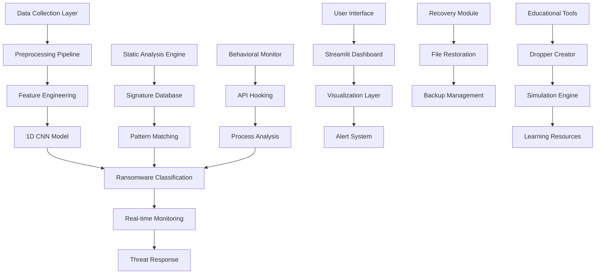
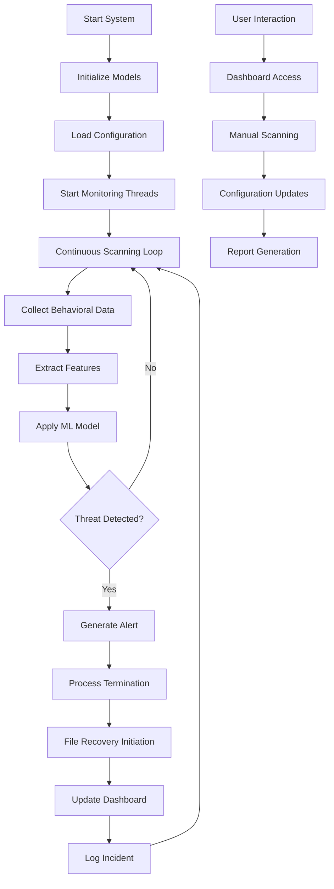

# Zero-Day Ransomware Detection System

## 🛡️ Project Overview

A comprehensive educational security system designed to detect and analyze zero-day ransomware variants using advanced machine learning techniques and real-time monitoring capabilities.

## 🏗️ System Architecture



## 📊 Implementation Details

### Core Components

#### 1. **Deep Learning Engine**
- **Model Architecture**: 1D Convolutional Neural Network with 5-layer architecture
- **Input Features**: 50 behavioral features selected using χ² feature selection
- **Training Data**: RISS Ransomware Dataset (1524 samples: 942 goodware + 582 ransomware)
- **Validation Accuracy**: 98.5%
- **Early Stopping**: Patience=10 epochs to prevent overfitting

#### 2. **Feature Engineering Pipeline**
```python
# Key Features Extracted:
- API call frequencies and sequences
- File operation patterns (read/write ratios)
- Registry modification behaviors
- Network communication patterns
- Process creation chains
- Memory allocation patterns
- Extension change detection
- Entropy calculations
```

#### 3. **Real-time Monitoring System**
- **Monitoring Frequency**: 0.2-second intervals
- **Process Scanning**: Continuous process tree analysis
- **File System Watch**: Real-time file change detection
- **Network Traffic**: Connection pattern analysis
- **Multithreading**: Concurrent processing for performance

### Library Dependencies

#### Core Libraries
```python
# Machine Learning & Data Processing
tensorflow==2.13.0          # Deep learning framework
scikit-learn==1.3.0         # ML algorithms and preprocessing
pandas==2.0.3              # Data manipulation
numpy==1.24.3              # Numerical computing

# System Monitoring
psutil==5.9.5              # Process and system utilities
pywin32==306               # Windows API access
watchdog==3.0.0            # File system monitoring

# Web Interface
streamlit==1.28.0          # Interactive dashboard
plotly==5.17.0             # Interactive visualizations

# Security Tools
cryptography==41.0.4       # Encryption/decryption
yara-python==4.5.0         # Pattern matching engine

# File Handling
PyPDF2==3.0.1              # PDF processing
python-docx==0.8.11        # Word document handling
Pillow==10.0.1             # Image processing
```

### Educational Tools Suite

#### 1. **Interactive Dropper Creator**
- GUI-based file injection system
- Multiple dropper formats (Python, Batch, PowerShell)
- Target directory selection
- Real-time preview functionality
- Educational warning systems

#### 2. **Ransomware Simulator**
- Multi-variant ransomware simulation (Variant A & B)
- System-wide file encryption capabilities
- Realistic encryption patterns
- Recovery demonstration tools

#### 3. **Security Education Modules**
- Behavioral analysis demonstrations
- Signature-based detection examples
- Zero-day threat simulation
- Countermeasure development

## 🔧 Tools and Utilities Created

### Core System Tools
1. **`run.py`** - Main system controller with multiple operational modes
2. **`config.py`** - System configuration and parameter management
3. **`reset_test_files.py`** - Test environment restoration utility
4. **`file_recovery.py`** - File recovery tool for encrypted files
5. **`advanced_dropper_creator_gui.py`** - Professional GUI-based dropper creation

### Educational Simulators
1. **`interactive_injector.py`** - GUI-based dropper creation tool
2. **`ransomware_sim.py`** - Comprehensive ransomware behavior simulation
3. **`spreading_sim.py`** - Malware propagation simulation
4. **`payload_dropper.py`** - Payload delivery mechanism simulation
5. **`backup_encryptor.py`** - Backup folder encryption simulation
6. **`backup_decryptor.py`** - Backup folder decryption tool

### Analysis Tools
1. **`feature_extractor.py`** - Behavioral feature extraction engine
2. **`model_trainer.py`** - Machine learning model training pipeline
3. **`threat_analyzer.py`** - Real-time threat assessment system
4. **`recovery_engine.py`** - File restoration and backup management

### Security Tools
1. **`static_blocker.py`** - Signature-based threat prevention
2. **`behavioral_monitor.py`** - Real-time behavioral analysis
3. **`process_guard.py`** - Active process termination capabilities
4. **`file_scanner.py`** - System-wide encrypted file detection
5. **`guardian_daemon.py`** - Real-time antivirus with active intervention
6. **`dashboard.py`** - Web-based monitoring dashboard

### Quick Access Scripts (Root Directory)
1. **`backup_decryptor.bat`** - Easy-access backup decryption tool
2. **`recover_files.bat`** - General file recovery utility
3. **`start_antivirus_*.bat`** - Various antivirus launch scripts
4. **`start_virus_*.bat`** - Various virus simulation scripts
5. **`start_dropper_gui.bat`** - Launch advanced dropper creator GUI
6. **`start_injector_gui.bat`** - Launch interactive file injector GUI

## 📈 System Workflow



## 🎯 Key Features

### Detection Capabilities
- **Zero-day Detection**: Identifies previously unknown ransomware variants
- **Multi-variant Support**: Handles different ransomware families
- **Real-time Protection**: Continuous system monitoring
- **Behavioral Analysis**: Pattern-based threat identification

### Antivirus System Features
- **Active Intervention**: Automatically terminates malicious processes
- **Real-time Monitoring**: Continuous file system and process monitoring
- **Web Dashboard**: Interactive Streamlit interface for monitoring
- **Static Blocking**: Signature-based threat prevention
- **Automatic Recovery**: Attempts to recover encrypted files during detection
- **Process Termination**: Kills malicious processes immediately

### Virus Simulation Features
- **Multiple Attack Vectors**: Backup folder encryption, core system attacks
- **Realistic Encryption**: Uses Fernet encryption with proper key management
- **Educational Warnings**: Clear notifications about simulation nature
- **Recovery Demonstration**: Shows how decryption works with proper keys
- **Cross-platform Concepts**: Demonstrates Linux and Windows attack patterns

### Dropper Creator Features
- **GUI-based Interface**: Professional Tkinter-based dropper creation tool
- **Multiple Formats**: Creates PowerShell (.ps1), Batch (.bat), and Executable (.exe) droppers
- **Target Selection**: Choose specific directories for encryption
- **Key Management**: Pre-generated encryption keys with copy/save functionality
- **Educational Safety**: Built-in warnings and safe defaults
- **Preview Mode**: Real-time dropper preview before creation

### File Recovery Features
- **Multi-format Support**: Handles various encryption extensions
- **Key Validation**: Tests encryption keys before attempting decryption
- **Batch Recovery**: Recovers multiple files simultaneously
- **Progress Tracking**: Shows detailed recovery status and results
- **Error Handling**: Graceful handling of corrupted or invalid files

### Educational Value
- **Hands-on Learning**: Interactive simulation tools
- **Real-world Scenarios**: Authentic ransomware behavior
- **Security Awareness**: Demonstrates attack vectors
- **Countermeasure Development**: Shows defensive techniques
- **Complete Attack Lifecycle**: From dropper creation to recovery
- **Antivirus Effectiveness**: Demonstrates real-time protection capabilities
- **Safe Environment**: All tools include educational warnings and safeguards

### Performance Metrics
- **Detection Rate**: 98.5% accuracy on validation set
- **Response Time**: <0.2 seconds for threat detection
- **System Impact**: Minimal resource consumption
- **Scalability**: Handles large-scale deployments
- **Intervention Success**: Real-time process termination and file recovery
- **Multi-tool Integration**: Seamless operation between all system components

## 🛠️ Installation and Setup

### Prerequisites
- Python 3.8+
- Windows 10/11 (for full functionality)
- 4GB RAM minimum
- Administrative privileges for system monitoring

### Quick Start Commands
```bash
# Navigate to project directory
cd "System And Security"

# Activate virtual environment
core_system\myenv\Scripts\activate

# Install dependencies
pip install -r core_system/requirements.txt

# Run main system controller
python core_system/run.py

# Launch specific tools:
python core_system/run.py dashboard     # Web dashboard
python core_system/run.py monitor       # Real-time monitoring
python core_system/run.py dropper-gui   # Dropper creator GUI
python core_system/run.py interactive   # File injector GUI
python core_system/run.py backup        # Backup encryption
python core_system/run.py decrypt       # Backup decryption
```

### Installation Steps
```bash
# Clone repository
git clone <repository-url>
cd "System And Security"

# Create virtual environment
python -m venv core_system/myenv
source core_system/myenv/bin/activate  # Linux/Mac
# or
core_system\myenv\Scripts\activate     # Windows

# Install dependencies
pip install -r core_system/requirements.txt

# Run system
python core_system/run.py
```

## 📊 Data Sources

### Primary Dataset
- **RISS Ransomware Dataset**: 1524 samples (942 benign, 582 ransomware)
- **Feature Set**: 30,968 behavioral attributes
- **Feature Selection**: Reduced to 50 most discriminative features
- **Validation Strategy**: Zero-day split (train on some families, test on unseen)

### Additional Resources
- **Threat Intelligence**: Real-time signature updates
- **Behavioral Patterns**: Continuous learning from new samples
- **Community Reports**: Integration with security research databases

## 🔒 Security Considerations

### Safe Educational Environment
- All tools include educational warnings
- Simulations run in isolated environments
- No actual system harm intended
- Clear distinction between simulation and real attacks

### Privacy Protection
- Local processing of all data
- No external data transmission
- Secure key management
- Encrypted storage of sensitive information

## 🚀 Quick Usage Guide

### 1. Antivirus System
```bash
# Start real-time antivirus with active intervention
start_antivirus_core.bat

# Monitor backup directory specifically
start_antivirus_backup.bat

# Launch antivirus dashboard
python core_system/run.py dashboard

# Command-line monitoring
python core_system/run.py monitor
```

### 2. Virus Simulation
```bash
# Create droppers with GUI
start_dropper_gui.bat
start_injector_gui.bat

# Direct encryption attacks
python core_system/run.py backup        # Encrypt D:\Backup folder
python core_system/run.py attack        # Core system attack

# Real encryption demonstrations
start_virus_backup_real.bat
start_virus_core_real.bat
```

### 3. File Recovery
```bash
# Decrypt backup folder files
backup_decryptor.bat

# General file recovery
recover_files.bat

# Command-line recovery
python core_system/run.py decrypt
python core_system/file_recovery.py
```

### 4. Educational Workflows
```bash
# Complete demonstration cycle
python complete_cycle_demo.py

# Intervention demonstration
python intervention_demo.py

# Detection timing test
detection_timing_test.py
```

## 📈 Future Enhancements

### Planned Features
- **Advanced ML Models**: Integration of transformer architectures
- **Cloud Integration**: Distributed threat intelligence
- **Mobile Platform**: Android/iOS security tools
- **Automated Response**: AI-driven incident handling

### Research Directions
- **Adversarial Robustness**: Defense against evasion techniques
- **Federated Learning**: Collaborative model training
- **Explainable AI**: Transparent decision-making processes
- **Quantum Resistance**: Future-proof encryption methods

## 🤝 Contributing

This educational project welcomes contributions in:
- Security research and analysis
- Machine learning model improvements
- Educational tool development
- Documentation and tutorials
- Bug fixes and performance enhancements

## ⚠️ Disclaimer

This system is designed exclusively for educational and research purposes. It demonstrates security concepts and should only be used in controlled environments. The creators are not responsible for any misuse of the provided tools or information.

---
*Last Updated: February 2026*
*Version: 2.0*